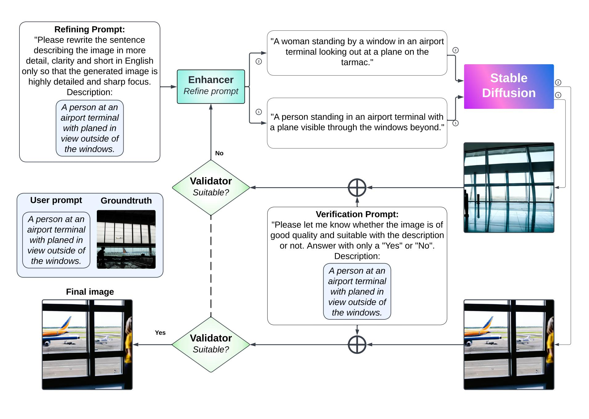
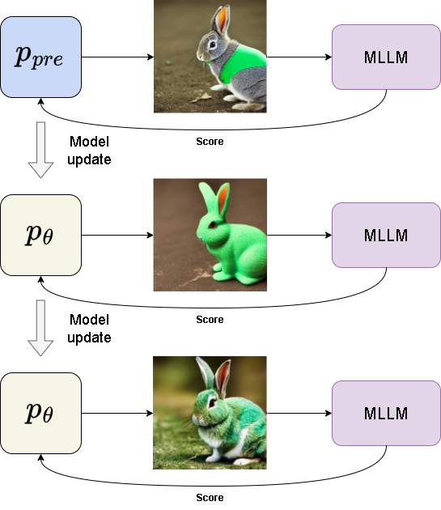

# Improving Text-to-Image Models with Artificial Intelligence Feedback

## Overview
This project explores the enhancement of text-to-image generation models by integrating multimodal large language models (MLLMs) for prompt enhancement and feedback simulation. The project is divided into two main stages:

1. **Improving text-to-image generation with MLLMs**
2. **Fine-tuning text-to-image models with active learning**

## Table of Contents
- [Introduction](#introduction)
- [Methodology](#methodology)
  - [Stage 1: Improving Text-to-Image Generation](#stage-1-improving-text-to-image-generation)
  - [Stage 2: Fine-Tuning with Active Learning](#stage-2-fine-tuning-with-active-learning)
- [Experiments and Results](#experiments-and-results)
- [Environment Setup](#environment-setup)
- [Acknowledgements](#acknowledgements)
- [License](#license)

## Introduction
The project aims to address challenges in generating high-quality images that accurately reflect textual descriptions. It proposes using MLLMs to enhance user input text and simulate feedback for continuous model improvement. The approach involves a two-stage process with detailed methodologies and evaluations.

## Methodology

### Stage 1: Improving Text-to-Image Generation
In this stage, we integrate MLLMs to enhance user prompts and verify the generated images for better alignment with user requests. The pipeline involves:
- **Prompt Enhancement**: Utilizing MLLMs to refine user input text.
- **Image Generation**: Generating images based on the enhanced prompts.
- **Image Verification**: Using MLLMs to validate the generated images and ensure they meet user expectations.



### Stage 2: Fine-Tuning with Active Learning
This stage incorporates an active learning framework where the text-to-image model generates images and MLLMs simulate user feedback. The process includes:
- **Feedback Simulation**: MLLMs provide scores for generated images based on user preferences.
- **Model Fine-Tuning**: Using reinforcement learning to adjust the model parameters based on feedback scores.
- **Iterative Refinement**: Continuously refining the model through multiple iterations of generation and scoring.



## Experiments and Results
Experiments were conducted on the MS-COCO dataset to evaluate the performance of the proposed methods. The results demonstrated significant improvements in image quality and alignment with user prompts compared to traditional models.

### Stage 1 Results
The first pipeline improved the initial image generation quality by enhancing the prompts and ensuring better alignment with the textual descriptions. Below are some examples of generated images before and after applying MLLM-based prompt enhancement:


### Stage 2 Results
The second pipeline further fine-tuned the model using simulated feedback from MLLMs. This active learning process resulted in continuous improvement in image quality and alignment with user preferences over multiple iterations. Some examples of iterative improvements are shown below:


## Environment Setup
To replicate the experiments and run the models, follow these steps:

1. Clone the repository:
    ```sh
    git clone https://github.com/yourusername/your-repo-name.git
    cd your-repo-name
    ```

2. Install the required dependencies:
    ```sh
    pip install -r requirements.txt
    ```

3. Set up the dataset and pre-trained models as described in the `setup.md` file.

4. Run the experiments:
    ```sh
    python main.py
    ```

## Acknowledgements
I would like to express my deep gratitude to my supervisors, Mr. Nguyễn Quang Đức and Dr. Nguyễn Đức Dũng, for their guidance and support throughout the research process. I also thank the Faculty of Computer Science and Engineering at the Ho Chi Minh City University of Technology for providing the knowledge and resources necessary to complete this project.
